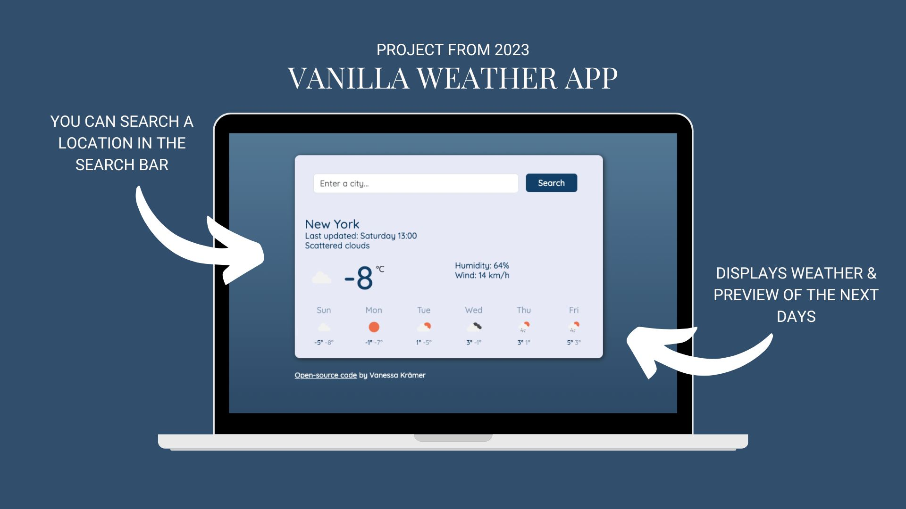

# VANILLA WEATHER APP

My project "Vanilla Weather App" includes a vanilla JS Code with an implementation of a weather api. You can search a location and use the button to display the current weather with humidity, wind and a preview of the next 5 days.

## Preview



## Link

Visit the countdown app
[countdown-app](https://heartfelt-dango-07ad0c.netlify.app/)

## Code Snippet

```JavaScript
# function formatDate(timestamp) {
  let date = new Date(timestamp);
  let hours = date.getHours();
  if (hours < 10) {
    hours = `0${hours}`;
  }
  let minutes = date.getMinutes();
  if (minutes < 10) {
    minutes = `0${minutes}`;
  }
```

## Author

- Vanessa Krämer
  - Aspiring Frontend Developer
  - Developer Akademie Student

## Acknowledgements

- SheCodes Workshop "Web Development"
- Matt Delac - _head of SheCodes_
